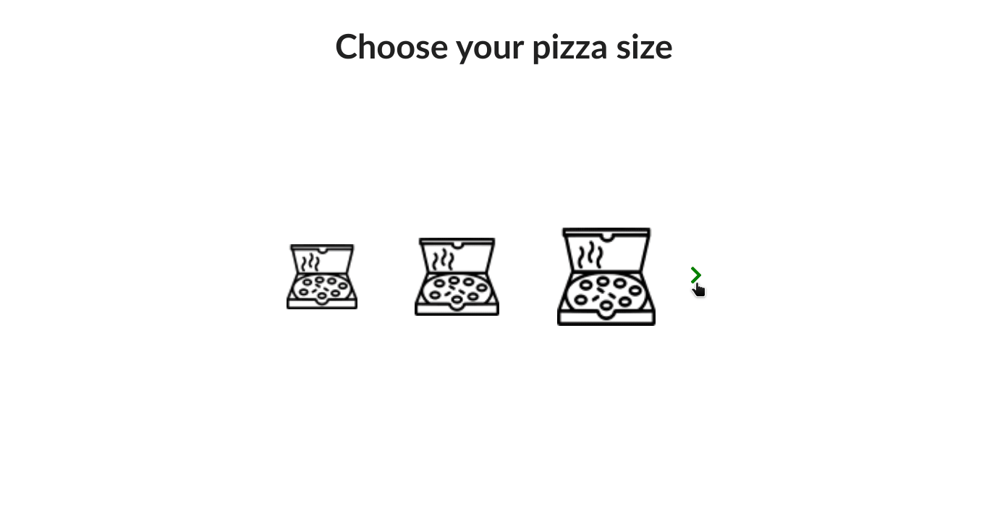

# Pizza Order App

This is a simple project that uses React and Redux to mock what would be a simple online pizza order.

## Get it up and running

### With Node and NPM Installed (Execute this process to the api and client project) .

1 - Install the dependencies

```bash
npm install
```

2 - Execute the project
```bash
npm start
```

#### A sample of the app being used


